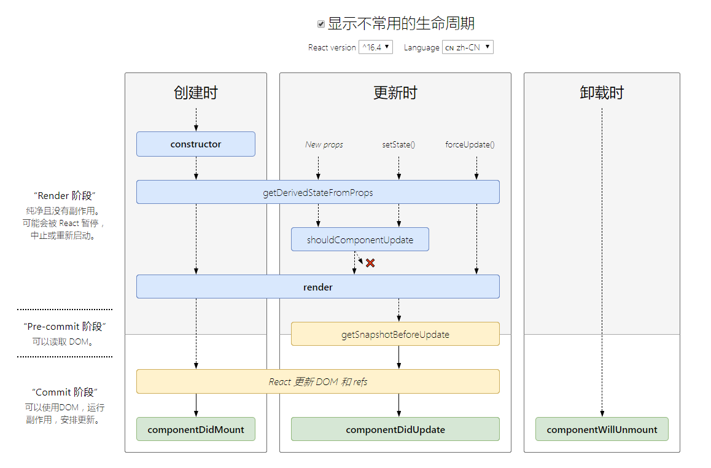

## 第3篇笔记
#### 生命周期
v16.4 之前的生命周期

```
import React, { Component } from 'react'
import PropTypes from 'prop-types'
export default class LifeCyclePage extends Component {
    static defaultProps = {
        msg: 'omg'
    }
    static propTypes = {
        msg: PropTypes.string.isRequired
    }
    constructor(props) {
        super(props)
        this.state = { count:0 }
        console.log('constructor :>> ')
    }
    componentWillMount() {
        console.log('componentWillMount :>> ')
    }
    componentDidMount() {
        console.log('componentDidMount :>> ')
    }
    shouldComponentUpdate(nextProps, nextState) {
        console.log('shouldComponentUpdate :>> ', nextState)
        return true
    }
    componentWillUpdate() {
        console.log('componentWillUpdate :>> ')
    }
    componentDidUpdate() {
        console.log('componentDidUpdate :>> ')
    }
    setCount = () => {
        this.setState({
            count: this.state.count + 1
        })
    } 
    render() {
        console.log('render :>> ', this.props)
        const { count } =  this.state
        return (
            <div>
                <h3>LifeCyclePage</h3>
                <h4>count的值：{count}</h4>
                <button onClick={this.setCount}>改变count</button>
                {count % 2 == 0 && <Child />}
            </div>
        )
    }
}
class Child extends Component {
    // 初次渲染的时候不会执行
    // 只有在已挂载的组件接收新的props的时候才会执行
    componentWillReceiveProps(nextProps) {
        console.log('componentWillReceiveProps :>> ', nextProps)
    }
    componentWillUnmount() {
        console.log('componentWillUnmount :>> ')
    }
    render() {
        console.log('Child Render :>> ')
        const { count } = this.props
        return (
            <div>
                <h3>Child</h3>
                <p>{count}</p>
            </div>
        )
    }
}
```
> v17之后废除的3个生命周期
> 1. componentWillMount
> 2. componentWillReceiveProps
> 3. componentWillUpdate
>  
> 控制台报警告，添加UNSAFE_
> 
`npx react-codemod rename-unsafe-lifecycle <path>`
v16.4 之后的生命周期

引入两个新的生命周期
`1. static getDerivedStateFromProps`
`2. getSnapshotBeforeUpdate`
1. `static getDerivedStateFromProps(props, state)`
   &emsp;&emsp;getDerivedStateFromProps会在调用render方法之前调用，并且在初始挂载及后续更新时都会被调用。它应返回一个对象来更新state，如果返回null则不更新任何内容
   &emsp;&emsp;请注意，不管原因是什么，都会在每次渲染前触发此方法，这与`UNSAFE_componentWillReceiveProps`形成对比，后者仅在父组件重新渲染时触发，而不是在内部使用setState时
2. `getSnapshotBeforeUpdate(prevProps, prevState)`
   &emsp;&emsp;在render之后，在componentDidUpdate之前
   &emsp;&emsp;`getSnapshotBeforeUpdate`在最近一次渲染输出（提交到DOM节点）之前调用，它使得组件能在发生更改之前从DOM中捕获一些信息（例如，滚动位置）。此生命周期的任何返回值将作为参数传递给`componentDidUpdate(prevProps, prevState, snapshot)`
```
import React, { Component } from 'react'
import PropTypes from 'prop-types'
export default class LifeCyclePage extends Component {
    static defaultProps = {
        msg: 'omg'
    }
    static propTypes = {
        msg: PropTypes.string.isRequired
    }
    constructor(props) {
        super(props)
        this.state = { count:0 }
        console.log('constructor :>> ')
    }
    static getDerivedStateFromProps(props, state) {
        console.log('getDerivedStateFromProps :>> ')
        const { count } = state
        // count不能大于5，大于5归0
        return count > 5 ? {count : 0} : null
    }
    componentDidMount() {
        console.log('componentDidMount :>> ')
    }
    shouldComponentUpdate(nextProps, nextState) {
        console.log('shouldComponentUpdate :>> ', nextState)
        return true
    }
    getSnapshotBeforeUpdate(prevProps, prevState) {
        console.log('getSnapshotBeforeUpdate :>> ',prevProps, prevState)
        return {
            msg: '从getSnapshotBeforeUpdate传递'
        }
    }
    componentDidUpdate(prevProps, prevState, snapShot) {
        console.log('componentDidUpdate :>> ',prevProps, prevState, snapShot)
    }
    setCount = () => {
        this.setState({
            count: this.state.count + 1
        })
    } 
    render() {
        console.log('render :>> ', this.props)
        const { count } =  this.state
        return (
            <div>
                <h3>LifeCyclePage</h3>
                <h4>count的值：{count}</h4>
                <button onClick={this.setCount}>改变count</button>
                {count % 2 === 0 && <Child />}
            </div>
        )
    }
}
class Child extends Component {
    componentWillUnmount() {
        console.log('componentWillUnmount :>> ')
    }
    render() {
        console.log('Child Render :>> ')
        const { count } = this.props
        return (
            <div>
                <h3>Child</h3>
                <p>{count}</p>
            </div>
        )
    }
}
```