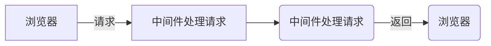

## 中间件

&emsp;&emsp;中间件就是一堆方法，可以接收客户端发来的请求，可以对请求做出相应，也可以将请求继续交给下一个中间件继续处理



&emsp;&emsp;可以针对一个请求设置多个中间件，对一个请求进行多次处理  
&emsp;&emsp;默认情况下，请求从上到下依次匹配中间件，一旦匹配成功，终止匹配  
&emsp;&emsp;可以调用 next 方法将请求的控制权交给下一个中间件，直到遇到结束请求的中间件

```
app.get('/request', (req, res, next) => {
    req.name = '张三'
    next()
})
```

```
app.get('/requst', (req, res) => {
    res.send(req.name)
})
```

---

### app.use 中间件用法

<font color=#0000FF >02.js</font>
app.use 匹配所有的请求方式，可以直接传入请求处理函数，代表接收所有的请求

```
app.use((req, res, next) => {
    console.log(req.url)
    next()
})
```

app.use 第一个参数也可以传入请求地址，代表不论什么请求方式，只要是这个请求地址就接收这个请求

```
app.use('/admin', (req, res, next) => {
    console.log(req.url)
    next()
})
```

---

### 中间件的应用

<font color=#0000FF >03.js</font>

1. 路由保护，客户端在访问需要登陆的页面时，可以先使用中间件判断用户登陆状态，用户如果未登录，则拦截请求，直接响应，禁止用户进入需要登陆的页面
2. 网站维护公告，在所有路由的最上面定义接收所有请求的中间件，直接为客户端作出响应，网站正在维护中
3. 自定义 404 页面

---

### 错误处理中间件

<font color=#0000FF >04.js</font>
在程序执行过程中，不可避免的会出现一些无法预料的错误，比如文件读取失败，数据库连接失败，错误处理中间件是一个集中处理错误的地方

```
app.use((err, req, res, next) => {
    // 只能自动捕获同步代码
    // 异步代码需要手动触发中间件
    res.status(500).send('服务器发生未知错误')
})

app.get('/', (req, res, next) => {
    fs.readFile('/file-does-not-exist', (err, data) => {
        if(err) {
            // 手动触发错误中间件
            next(err)
        }
    })
})
```

---

### 捕获错误

<font color=#0000FF >05.js</font>
在 node.js 中，异步 API 的错误信息都是通过回调函数获取的，支持 Promise 对象的异步 API 发生错误可以通过 catch 方法捕获。异步函数执行如果发生错误要如何捕获错误呢？

try catch 可以捕获异步函数以及其他同步代码在执行过程中发生的错误，不是不能捕获其他类型 API 发生的错误

```
app.get('/', (req, res, next) => {
    try {
        await User.find({name: '张三'})
    } catch (err)  {
        next(err)
    }
})
```

---

### 构建模块化路由

<font color=#0000FF >06.js</font>

```
const express = require('express')

// 创建路由对象
const home = express.Router()
// 将路由和请求路径进行匹配
app.use('/home', home)
// 在home路由下继续创建路由
home.get('/index', (req, res) => {
    // /home/index
    res.send('欢迎来到博客展示页面')
})
```

<font color=#0000FF >07.js + route=>admin.js、home.js</font>

---

### GET 参数的获取

<font color=#0000FF >08.js</font>
express 框架中使用 req-query 即可获取 GET 参数，框架内部会将 GET 参数转换为对象并返回

```
// 接收地址栏中问号后面的参数
// 例如：http://localhost:3000/?name=zhangsan&age=30
app.get('/', (req, res) => {
    console.log(req.query)
})
```

---

### POST 参数的获取

<font color=#0000FF >09.js + post.html</font>
express 中接收 post 请求参数需要借助第三方包 body-parser

```
// 引入body-parser模块
const bodyParser = require('body-parser')
app.use(bodyParser.urlencoded({ extended: false }))
// 接收请求
app.post('/add', (req, res) => {
    // 接收请求参数
    console.log(req.body)
})
```

---

### app.use 方法的使用

<font color=#0000FF >10.js</font>

```
const express = require('express')
const app = express()

app.use(fn({a: 1}))

function fn(obj) {
   return function(req, res, next) {
       if(obj.a == 1) {
           console.log('url :>> ', req.url);
       } else {
           console.log('req :>> ', req.method)
       }
       next()
   }
}

app.get('/', (req, res) => {
   res.send('ok')
})

app.listen(3000)
console.log('网站服务器启动成功')
```

---

### express 路由参数

<font color=#0000FF >11.js</font>

```
app.get('/find/:id', (req, res) => {
    console.log(req.params)
})
```

请求地址：id 对应 123

```
localhost:3000/find/123
```

---

### 静态资源的处理

<font color=#0000FF >12.js</font>

通过 express 内置的 express.static 可以方便地托管静态文件，例如 img、css、javascript 文件等

```
 app.use(express.static('public'))
```

现在，public 目录下面的文件就可以访问了

http://localhost:3000/images/test.jpg
http://localhost:3000/css/style.css
http://localhost:3000/js/app.js
http://localhost:3000/hello.html

---

### 模板引擎

<font color=#0000FF >13.js</font>
使用`npm install art-template express-art-template`命令进行安装

```
// 当渲染后缀为art的模板时，使用express-art-template
app.engine('art', require('express-art-template'))
// 设置模板存放目录
app.set('views', path.join(__dirname, 'views'))
// 渲染模板时不写后缀，默认拼接art后缀
app.set('view engine', 'art')
app.get('/', (req, res) => {
    // 渲染模板
    res.render('index')
})
```

### app.locals 对象

<font color=#0000FF >14.js</font>
将变量设置到 app.locals 对象下面，这个数据在所有的模板中都可以获取到

```
app.locals.users = [
    {
        name: '张三',
        age: 20
    },
    {
        name: '李四',
        age: 30
    }
]
```
