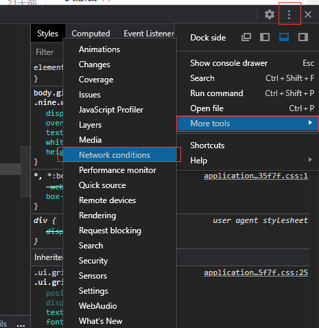
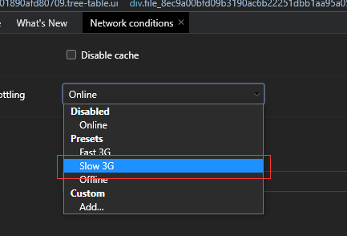
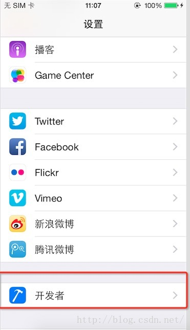
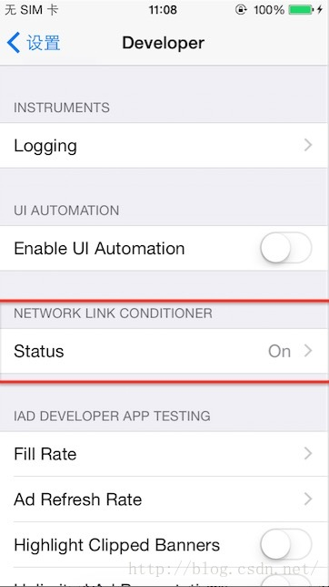
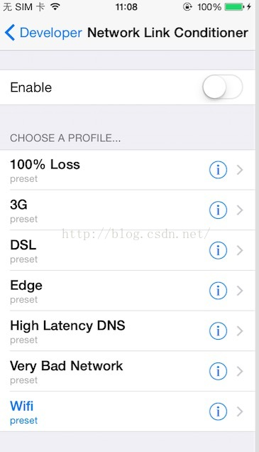
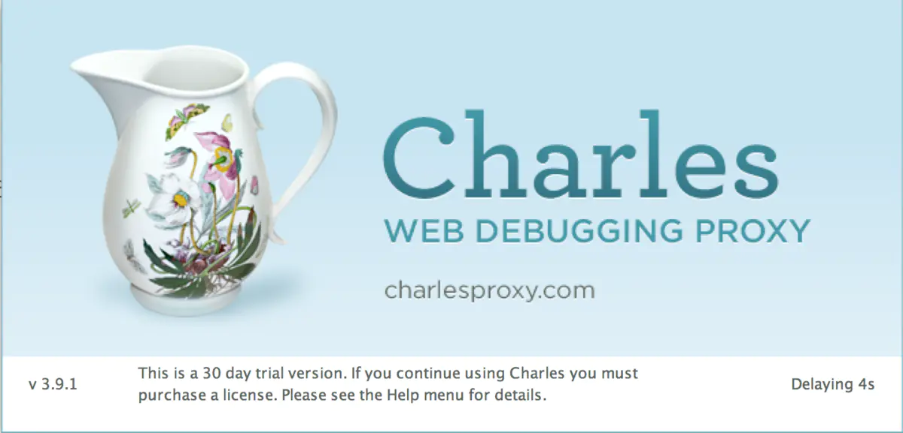
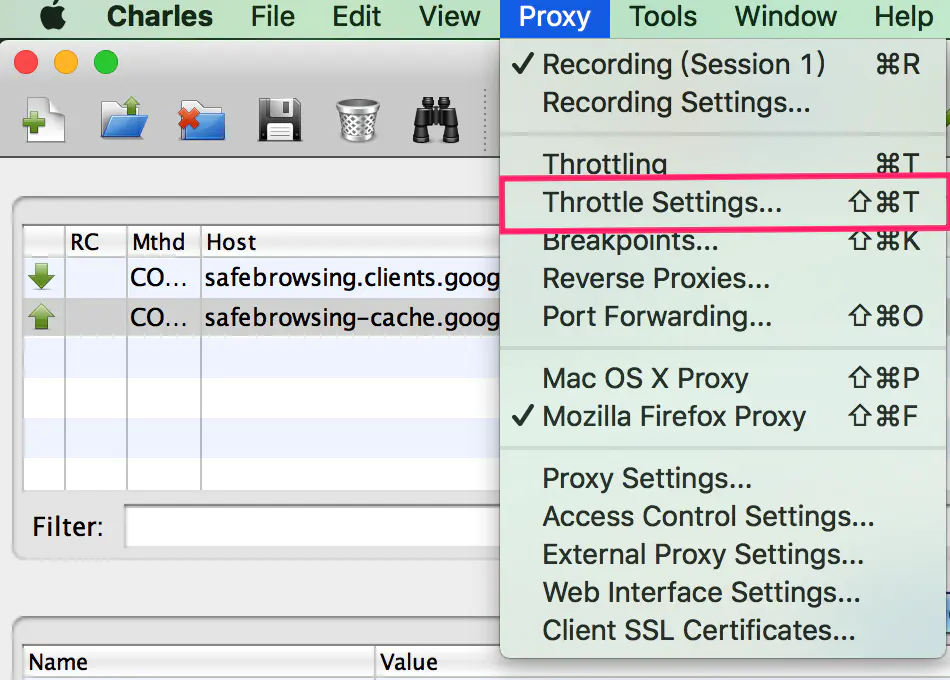
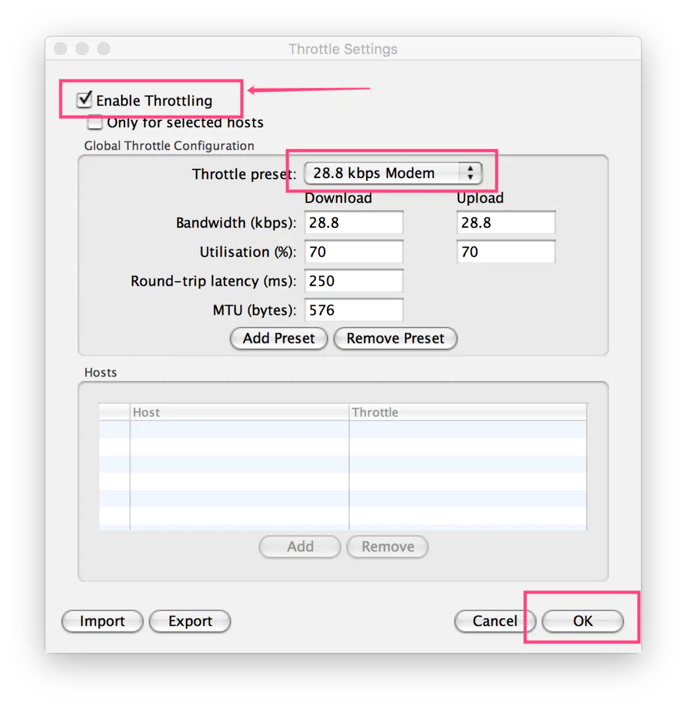
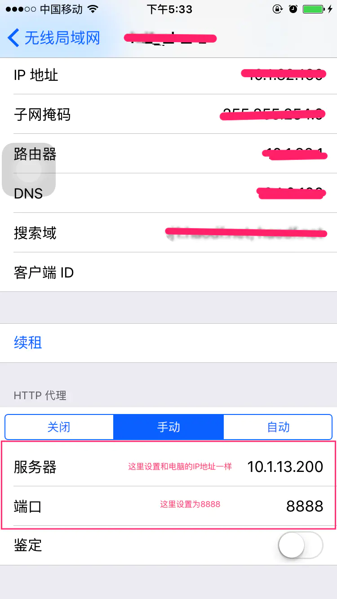

## 如何模拟低网速：

### 电脑端：

浏览器版本：65.0.3325.181（正式版本） （64 位） 按F12呼出开发人员工具 

### 手机端模拟低网速：

17年5月10日更新：

以下做法完全可以被抛弃，你只需要：
打开你手机的“设置”->点击“开发者”->进入Status->打开Enable，选择你需要的网络

在手机端可以这样去用
第一步：进入设置点击开发者

第二步：点击NETWORK LINK CONDITIONER中的Status,默认是Off

第三步：点击Enable启用，下面就是选择各种网络，然后就可以去测试了。（* 记住，在使用完后一定要关闭，否则会影响正常网络访问）

--------------------------------------------------------------------------------

工具：Charles

步骤一：安装好Charles软件，并进入；

步骤二：设置节流网速

点击"Throttle Settings"进入节流设置界面：

勾选：Enable Throttling
在Throttle preset中选择你需要的网速！

步骤三：设置手机

打开手机设置界面，进入当前连接的Wi-Fi的详情设置界面。将HTTP代理设置为手动。服务器填和电脑一样的IP地址，端口填8888；如下图：

步骤四：OK！去测试吧！
然后你手机连接的该Wi-Fi网速就变慢了，可以用来模拟网速较差的情况了，赶快去测试吧！

>> 作者：原文链接：https://www.jianshu.com/p/85784760b83b来源

-----

## 编写解释器，英文开源教材

http://craftinginterpreters.com/contents.html

---

## 图片加载失败兜底

https://www.zhangxinxu.com/wordpress/2020/10/css-style-image-load-fail/

---

## node-sass安装解决方案

https://blog.csdn.net/ken_ding/article/details/85623092

----

##  Axios取消终止请求（上传文件时撤销）
http://www.axios-js.com/zh-cn/docs/#%E5%8F%96%E6%B6%88 
##  Axios上传文件获取进度
https://blog.csdn.net/m0_46627730/article/details/107284898