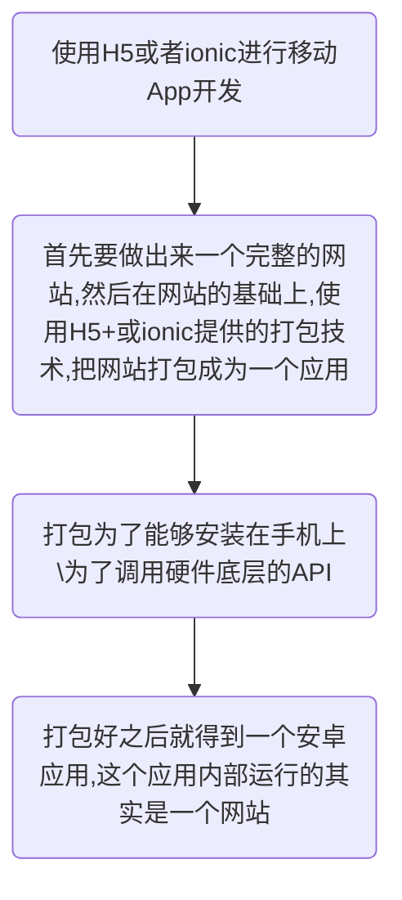
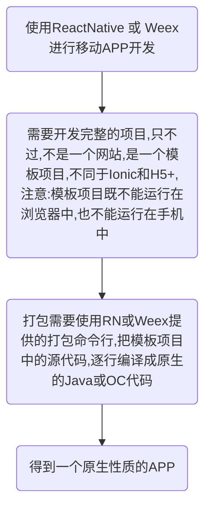

## React
混合APP开发：
1. 壳+web应用 
2. RN(React Native)
游戏类对运行有高要求的应用，使用原生开发
一般应用类，使用混合应用开发

##### 混合应用开发  技术选型

1. Angular + Ionic
2. Vue + Weex
3. React + React Native
(Ionic、 Weex、React Native提供组件和打包工具)

Html5+
https://www.dcloud.io/runtime.html
DCloud推出免费的HTML5开发IDE“HBuilder”，以改善HTML5开发工具弱于原生的问题
Html5 APP开发生态社区

------
### 壳+web应用

1. 在开发网站期间，可以使用Ionic或H5+提供的UI组件，快速开发一个漂亮的网站
2. 在打包时候，使用Ionic或H5+提供的打包技术,很方便的得到一个打包好的应用，然后推送到应用商店，就可以供用户下载使用了
3. 好处:开发效率高;
4. 缺点:内部本质上是一个网站,运行效率和性能不太好

### RN(React Native)

1. 打包完毕后得到的手机APP，是全部转化为原生代码的，这是一个真正原生性质的APP，只不过是使用前端技术开发的
2. 体验好，性能好；缺点是可用组件没有H5多

-----

#### 开发环境配置

1. 安装Java
2. 安装node.js
3. 安装C++环境(大多数系统都有)
4. 安装git环境
5. 安装Python环境
6. 配置安卓环境

资源：http://www.react-native.cn/   (React Native中文网)

>技术对比(来自知乎)

|对比层面|React Native|WEEX|Flutter
|-|-|-|-|
|支持平台|Android/iOS|Android/iOS/Web|Android/iOS
|实现技术|Javascript|Javascript|原生编码/渲染
|引擎|Javascript V8|JavascriptCore|Flutter Engine
|编程语言|React|Vue.js|Dart
|bundle大小|单一、较大|较小、多页面|不需要
|框架程度|较重|较轻|重
|公司|Facebook|阿里|Google

##### 配置安卓环境

> ### 配置安卓环境
> 1. 安装`installer_r24.3.4-windows.exe`，最好手动选择安装到C盘下的android目录
> 2. 打开安装的目录，将`android-25`、`android-23`(react-native必须依赖这个)解压后，放到`platforms`文件夹下
> 3. 解压`platform-tools`，放到`platform-tools`文件夹下
> 4. 【这一步直接忽略即可！】**tools文件夹不解压覆盖也行；**~~解压`tools`，放到安装根目录中~~
> 5. 解压`build-tools_r23.0.1-windows.zip(react-native必须依赖这个)`、`build-tools_r23.0.2-windows.zip(weex必须依赖这个)`和`build-tools_r23.0.3-windows.zip`，并将解压出来的文件夹，分别改名为版本号`23.0.1`、`23.0.2`和`23.0.3`；在安装目录中新建文件夹`build-tools`，并将改名为版本号之后的文件夹，放到新创建出来的`build-tools`文件夹下
> 6. 在安装目录中，新建`extras`文件夹，在`extras`文件夹下新建`android`文件夹；解压`m2responsitory`文件夹和`support`文件夹，放到新建的`extras -> android`文件夹下
> 7. 配置安装环境变量：在系统环境变量中新建`ANDROID_HOME`，值为android SDK Manager的安装路径`C:\Users\liulongbin\AppData\Local\Android\android-sdk`，紧接着，在Path中新增`;%ANDROID_HOME%\tools;%ANDROID_HOME%\platform-tools;`

----

#### Yarn、React Native的命令行工具(react-native-cli)

Yarn约等于npm
1. 设置镜像源：
`yarn config set registry https://registry.npm.taobao.org --global`
`yarn config set disturl https://npm.taobao.org/dist --global`
  
2. 更新npm命令：
`npm i npm -g`

#### 创建一个项目

1. 命令行运行`react-native init 项目名`

> Run instructions for iOS:
    • cd "E:\VSCodeProject\demoProj\reactLearn\myrn01" && npx react-native run-ios
    - or -
    • Open myrn01\ios\myrn01.xcodeproj in Xcode or run "xed -b ios"
    • Hit the Run button

> Run instructions for Android:
    • Have an Android emulator running (quickest way to get started), or a device connected.
    • cd "E:\VSCodeProject\demoProj\reactLearn\myrn01" && npx react-native run-android

2. 检查是否有设备链接
  `adb devices`