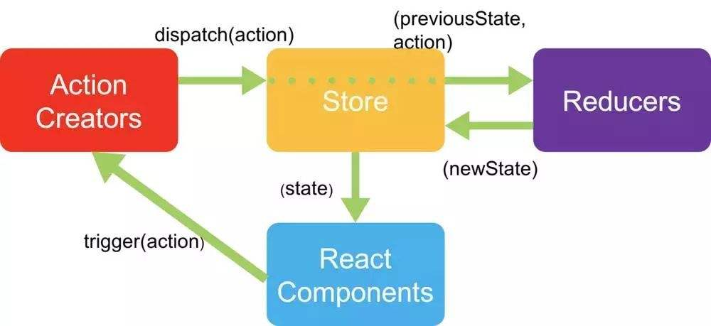

## 第5篇笔记
#### Redux
1. 什么时候需要Redux
2. Redux的使用
&emsp;&emsp;Redux是负责组织state的工具，需要考虑是否适合。
以下场景中，使用Redux是明智的
- 你有着相当大量的、随时间变化的数据
- 你的state需要有一个单一可靠数据来源
- 你觉得把所有state放在最顶层组件中已经无法满足需要
- 某个组件状态需要共享
<br/>
<br/>
安装
`npm install redux --save`
Redux流程图
 
##### 代码实例：
###### store=>index.js
```
import { createStore } from 'redux'
// 定义state初始化和修改规则,reducer是一个纯函数
function counterReducer(state=0, action) {
    switch(action.type) {
        case "ADD":
            return state += 1
        case "MINUs":
            return state -= 1
        default:
            return state
    }
}
const store = createStore(counterReducer)
export default store
```
###### ReduxPage.js
```
import React, { Component } from 'react'
import store from './store/index';
export default class ReduxPage extends Component {
    componentDidMount() {
        store.subscribe(() => {
            console.log('store发生变化:>> ')
            // 重新渲染
            this.forceUpdate() 
            // 重新渲染
            // ReactDOM.render()
        })
    }
    render() {
        console.log('store :>> ', store)
        return (
            <div>
                <h3>Redux Page</h3>
                <p>{store.getState()}</p>
                <button 
                    onClick={() => store.dispatch({type: 'ADD'})}
                >
                    Add
                </button>
            </div>
        )
    }
}
```
###### App.js
```
import React from 'react'
import ReduxPage from './ReduxPage'
function App() {
  return (
    <div>
      <ReduxPage />
    </div>
  )
}
export default App;
```
<font color=#FF0000 >检查点：</font>
1. createStore创建store
2. reducer初始化、修改状态函数
3. getState获取状态值
4. dispatch提交更新
5. subscribe变更订阅